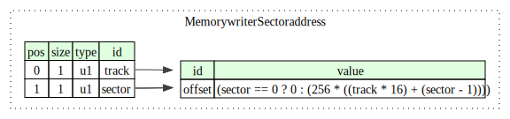
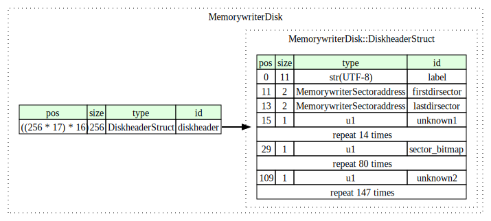
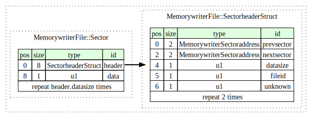
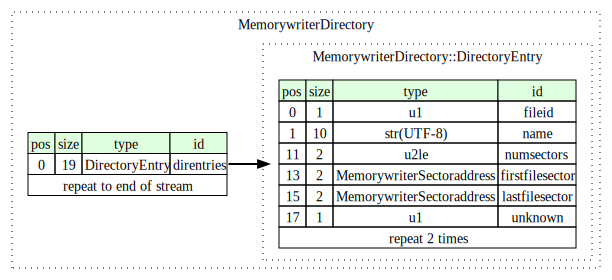
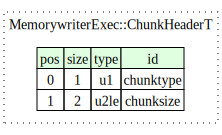
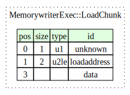
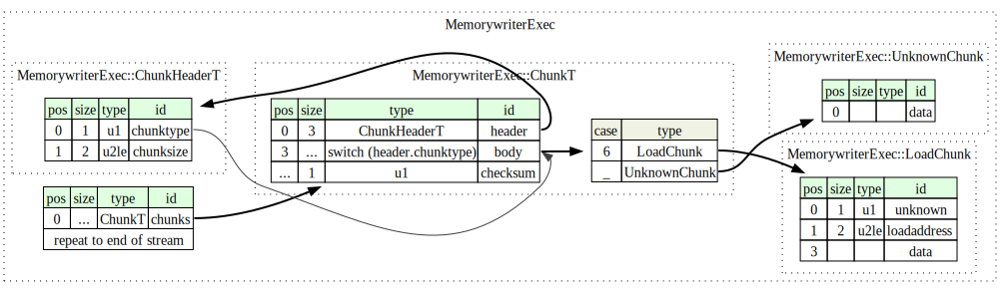

Tool to extract the files from Xerox Memorywriter 645S floppy disks.

Inspired by @TechTangents videos:

- https://youtu.be/pOdDaL4TgmU
- https://youtu.be/hudO51kU15w
- https://youtu.be/II5M968YBCM

Disk images are available on archive.org:
https://archive.org/details/xerox-memory-writer-645-640-base-0

## Usage:
#### Extract the files from a disk image in IMG (raw sectors) format:

`python3 memorywriter_dump.py <disk image>` 

#### Convert an extracted chunked executable file into a linear format suitable for analysis in Ghidra or IDA:

`python3 memorywriter_loader.py <executable file>` 

## Memorywriter 645S disk format

### General
Disks are 160 KB per side, organized as 40 tracks, 16 sectors/track with a sector size of 256 bytes. 

Sectors are addressed using 2 bytes containig track number and sector number within the track:

Tracks are numbered from 1 to 39, the sectors within a track are numbered from 1 to 16.

### Disk header
Each disk contains a "disk header" block on track 17, sector 1. The disk header has the following structure:

The header contains the disk label, the first and least sectors of the disk's directory and the sector bitmap. The sector bitmap contains a bit for each sector on the disk, with the most significant bit representing track 0 sector 1 and the least significant bit track 39 sector 16. A "1" bit indicates the corresponding sector is in use.

### Files
A file is stored as a doubly linked list of sectors. Each sector that is part of a file contains an 8-byte sector header followed by the actual data bytes:

The sector header contains the addresses of the previous and next sector in the file, a 1-byte file ID and the number of actual data bytes in this sector. The first sector in a file has its "previous sector" field set to the invalid sector address track 0, sector 0; the last sector in a file has its "next sector" set to track 0, sector 0.

### Directory

The disk's directory is stored as a file (doubly linked list of sectors, see previous section), with its first and last sectors listed in the disk header at track 17 sector 1. The directory file contains a 19-byte record for each file:

The directory entry for each file contains the file ID, file name, the number of sectors the file occupies and the addresses of the first and last sector in the file. The file ID stored in a directory entry corresponds with the file ID present in the corresponding file's sector headers.

### Executables
Executable files are stored as a sequence of chunks, where each chunk starts with a 3-byte header specifying the chunk's type and size. The last byte in a chunk is the checksum, such that the sum of all chunk bytes including the header modulo 256 is 0.

Executable files are made up of chunks of type 6. Each chunk of type 6 contains a 3-byte secondary header specifying the address at which the chunk's data should be loaded:

The last chunk in an executable seems to be always of type 4, its exact meaning is unknown.

The full structure of an executable file:

